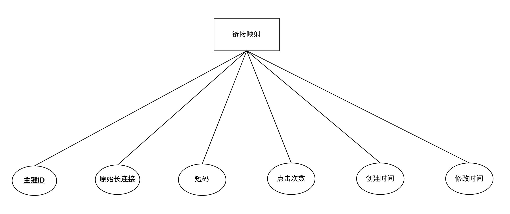

# **短链接服务 – 数据库说明书**

---

> **项目名称**：se-go-url-shortener-2026
> 
> **版本**：v1.1
> 
> **日期**：2026-06-02
> 
> **编写人**: 刘灿阳 

---

[TOC]

---

## 一、引言

### 1.1 文档目的
本文档用于阐述短链接服务项目的数据库设计内容，包括运行环境、命名规则、安全性设计以及详细表结构。

### 1.2 术语定义
| 术语 | 定义 |
|------|------|
| 短码（Short Code） | 唯一标识一个短链接的字符串，由字母和数字组成（Base62）。 |
| 索引（INDEX） | 索引是一种数据结构。 |
| 热点短链 | 高频访问的短链接，会被缓存到 Redis 中 |

### 1.3 参考资料
| 文档名称 | 版本 | 作者 |
|----------|------|------|
| 短链接服务 – 需求规格说明书 | v1.0 | 刘灿阳 |

---

## 二、运行环境与架构设计

### 2.1 数据库环境说明
- **数据库系统**：MySQL 8.0.46（Community Server）
- **部署方式**：Windows 本地开发环境（后续将迁移至 Docker 容器）
- **连接信息**：主机 `localhost`，端口 `3306`，字符集 `utf8mb4`
- **存储引擎**：InnoDB（支持事务、行级锁、外键）

### 2.2 支持软件
- **操作系统**：Windows 11（开发环境）/ Linux（生产环境）
- **数据库管理系统**：MySQL 8.0.46 Community Server
- **数据库访问驱动**：`github.com/go-sql-driver/mysql` v1.10.0（用于 Go 应用连接）
- **可选管理工具**：Navicat Premium 16 / MySQL Workbench 8.0

---

## 三、数据库命名规则

### 3.1 基本对象命名规范参照表
主要介绍数据库对象名的命名规则，主要的数据库对象包含：数据库（DataBase）、表（Table）、索引（Index）等。以下范例仅供参考。 
| 对象类型 | 前缀 | 范例 |
|----------|------|------|
| 表（Table） | `t_` | `t_short_link` |
| 索引（Index） | `idx_` | `idx_link_map_short_code` |

### 3.2 数据库命名规范
- 数据库名：`shortlink_db`（全小写）  
- 表名：以 `t_` 开头，全小写，单词间用下划线分隔，例如 `t_link_map`。  
- 字段名：全小写，单词间用下划线分隔，例如 `short_code`、`click_count`。  
- 禁止使用 SQL 关键字（如 `select`、`table`）作为表名或字段名。
- 所有关键字最好大写，如：DELETE、UPDATE、INSERT等。 

### 3.3 表名命名规范
表名以 t_ 开头，全小写，单词间用下划线分隔。本系统仅一张核心表：`t_link_map`（链接映射表）。

### 3.4 索引命名规范
索引名必须以"idx_"开头，做到以固定格式开头外，能准确反映在哪个表，那个字段上建立索引关系，并且唯一索引同样使用 idx_ 前缀，但在创建时须使用 UNIQUE KEY 关键字。例如 `idx_link_map_short_code`。

---

## 4. 安全性设计

### 4.1 访问控制
- 数据库账户分为读/写账户与只读账户，应用程序使用读写账户。  
- 密码加密存储，禁止明文配置。

### 4.2 数据加密
- 无敏感个人信息，不涉及加密存储。  

### 4.3 备份策略
- 开发环境：无自动备份，手动导出 SQL。  
- 生产环境（若有）：每日全量备份，保留最近 7 天。

### 4.4 审计日志
- 本版本不实现数据库审计，通过应用层日志记录关键操作。

---

## 五、详细设计

### 5.1 E-R 图

> 

本系统只有一张核心表——链接映射表（ `t_link_map`），包含 ID、短码、长链接、点击次数、创建时间、修改时间等字段。无其他关联表。

### 5.2 表清单
| 表名 | 注释 |
|------|------|
| `t_link_map` | 链接映射表 |

### 5.3 表结构详细说明

#### 5.3.1 `t_link_map`（链接映射表）

| 字段名 | 数据类型 | 允许空 | 默认值 | 注释 |
|--------|----------|--------|--------|------|
| id | BIGINT UNSIGNED | NO | AUTO_INCREMENT | 主键 ID |
| long_url | TEXT | NO | - | 原始长链接 |
| short_code | VARCHAR(16) | NO | - | 短码（唯一） |
| click_count | BIGINT | NO | 0 | 点击次数 |
| create_time  | DATETIME | NO | CURRENT_TIMESTAMP | 创建时间 |
| update_time | DATETIME | NO | CURRENT_TIMESTAMP ON UPDATE CURRENT_TIMESTAMP| 修改时间 |

### 5.4 索引设计
- 短码唯一索引：保证短码唯一，同时加速重定向查询，命名为：`idx_link_map_short_code` 。

### 5.5 建表 SQL 语句

```sql

CREATE TABLE t_link_map (
	id BIGINT UNSIGNED NOT NULL AUTO_INCREMENT COMMENT '主键ID',
	long_url Text NOT NULL COMMENT '原始长连接',
	short_code VARCHAR(16) NOT NULL COMMENT '短码（唯一）',
	click_count BIGINT NOT NULL DEFAULT 0 COMMENT '点击次数',
	create_time DATETIME NOT NULL DEFAULT CURRENT_TIMESTAMP COMMENT '创建时间',
	update_time DATETIME NOT NULL DEFAULT CURRENT_TIMESTAMP ON UPDATE CURRENT_TIMESTAMP COMMENT '修改时间', 
	PRIMARY KEY (id),
	UNIQUE KEY idx_link_map_short_code (short_code)
) ENGINE=InnoDB DEFAULT CHARSET=utf8mb4 COMMENT '链接映射表';
```

---

**版本记录**

| 版本 | 日期       | 修改说明                             |
| ---- | ---------- | ------------------------------------ |
| 1.0  | 2026-06-01 | 初始版本 |
| 1.1  | 2026-06-02 | 修缮 2.1、2.2、3.3、4.2，补充 5.1、5.5 |