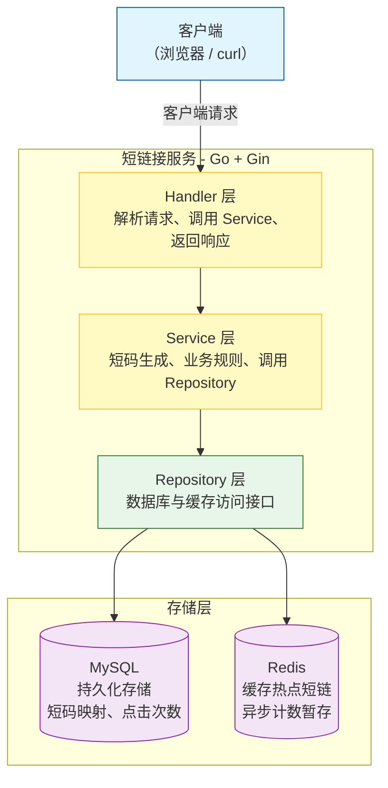
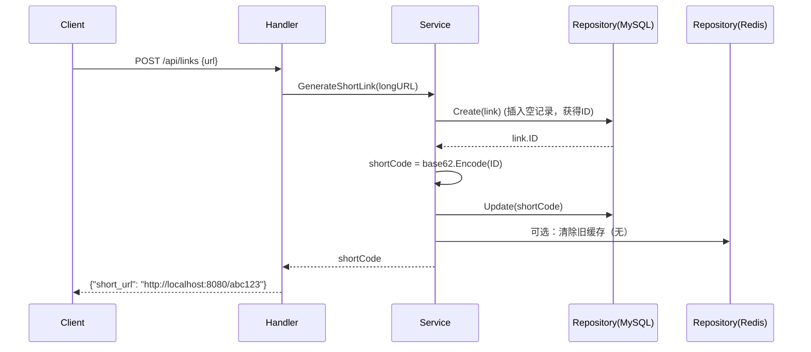
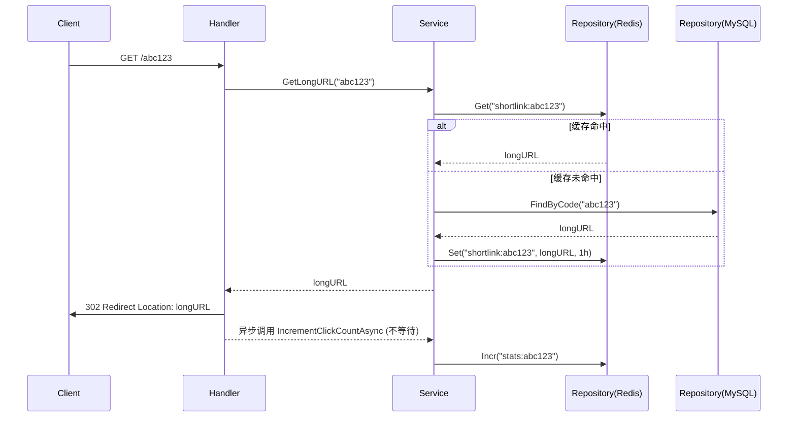
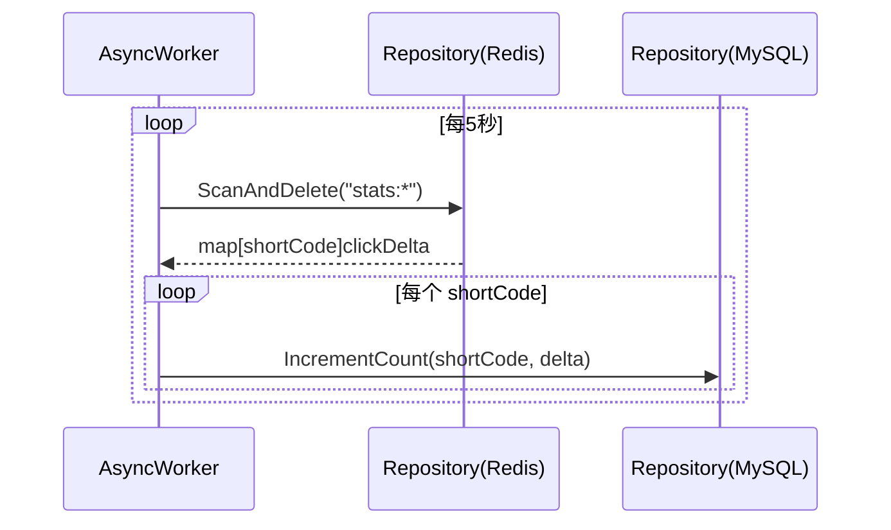

# **短链接服务 – 系统设计文档**

---

> **项目名称**：se-go-url-shortener-2026  
> 
> **版本**：v1.0  
> 
> **日期**：2026-06-04  
> 
> **编写人**：刘灿阳

---

[TOC]

---

## 一、系统架构

### 1.1 总体架构图（Mermaid）



### 1.2 核心组件说明

| 组件         | 技术选型               | 职责                                                       |
| ------------ | ---------------------- | ---------------------------------------------------------- |
| HTTP 服务    | Gin                    | 路由、请求解析、响应输出、中间件（日志、恢复、限流）       |
| 业务逻辑层   | 自定义 Service 包      | 短码生成算法、重定向逻辑、点击计数、限流控制、异步统计调度 |
| 数据访问层   | GORM + go-redis        | 封装 MySQL 和 Redis 操作，提供统一接口                     |
| 缓存策略     | 缓存旁路模式           | 读时先查 Redis，未命中查 MySQL 并回写；写时更新 MySQL 并删除缓存 |
| 限流         | 令牌桶（golang.org/x/time/rate） | 基于 IP 的生成接口限流，防止恶意刷链                      |
| 异步统计     | goroutine + ticker     | 将点击计数先记 Redis，定时批量回写 MySQL，减少数据库写压力 |
| 配置管理     | 环境变量 / config.toml | 加载服务端口、MySQL DSN、Redis 地址、限流参数等            |
| 日志         | log/slog               | 结构化 JSON 日志，记录请求方法、路径、短码、耗时等         |

### 1.3 技术选型对比

| 决策                     | 理由                                             | 替代方案                       |
| ------------------------ | ------------------------------------------------ | ------------------------------ |
| 使用 Gin 框架            | 轻量、高性能、中间件丰富、开发效率高             | 标准库 net/http（开发较慢）    |
| 使用 GORM                | 简化数据库操作，自动防 SQL 注入，支持自动迁移    | 手写 SQL + database/sql        |
| 使用 go-redis            | 官方维护，API 友好，支持 Redis 集群              | redigo                         |
| 自增 ID 转 base62 生成短码 | 实现简单，保证唯一，无需分布式协调               | 雪花算法、随机生成+查重        |
| 缓存采用 Cache-Aside     | 经典模式，控制灵活，适合读写比例高的场景         | 先更新缓存再写数据库（易不一致）|
| 异步批量写统计           | 降低数据库写压力，提高重定向接口吞吐量           | 每次重定向直接 UPDATE MySQL    |

---

## 二、模块详细设计

### 2.1 目录结构

```
se-go-url-shortener-2026/
├── cmd/
│   └── server/
│       └── main.go                 # 程序入口，依赖组装
├── internal/
│   ├── config/                     # 配置加载
│   │   └── config.go
│   ├── handler/                    # HTTP 处理层
│   │   └── shortlink.go
│   ├── service/                    # 业务逻辑层
│   │   └── shortlink.go
│   ├── repository/                 # 数据访问层
│   │   ├── mysql.go                # MySQL 操作
│   │   └── redis.go                # Redis 操作
│   └── model/                      # 数据模型
│       └── shortlink.go
├── pkg/                            # 可复用工具
│   ├── base62/                     # base62 编码解码
│   │   └── base62.go
│   └── limiter/                    # 限流中间件
│       └── ip_limiter.go
├── configs/
│   └── config.toml                 # 配置文件
├── docs/                           # 文档
├── test/                           # 集成测试
├── docker-compose.yml
├── Dockerfile
├── .gitignore
├── go.mod
├── go.sum
├── README.md
└── LICENSE
```

### 2.2 配置模块 (`internal/config`)

- **功能**：从 `config.toml` 或环境变量加载配置。
- **关键结构**：
  ```go
  type Config struct {
      Server   ServerConf   `toml:"server"`
      MySQL    MySQLConf    `toml:"mysql"`
      Redis    RedisConf    `toml:"redis"`
      RateLimit RateLimitConf `toml:"rate_limit"`
  }
  type ServerConf struct {
      Port int    `toml:"port"`
      Mode string `toml:"mode"` // debug/release
  }
  type MySQLConf struct {
      DSN string `toml:"dsn"`
  }
  type RedisConf struct {
      Addr     string `toml:"addr"`
      Password string `toml:"password"`
      DB       int    `toml:"db"`
  }
  type RateLimitConf struct {
      RequestsPerMinute int `toml:"requests_per_minute"`
  }
  ```
- **加载逻辑**：使用标准库 `encoding/toml` 读取。

### 2.3 模型层 (`internal/model`)

```go
type ShortLink struct {
	ID         uint64    `gorm:"primaryKey;autoIncrement"`
	LongURL    string    `gorm:"column:long_url;type:text;not null"`
	ShortCode  string    `gorm:"column:short_code;type:varchar(16);uniqueIndex;not null"`
	ClickCount int64     `gorm:"column:click_count;default:0"`
	CreateTime time.Time `gorm:"column:create_time;type:datetime;not null;default:CURRENT_TIMESTAMP"`
	UpdateTime time.Time `gorm:"column:update_time;type:datetime;not null;default:CURRENT_TIMESTAMP ON UPDATE CURRENT_TIMESTAMP"`
}
```

### 2.4 Repository 层 (`internal/repository`)

- **MySQL 仓库**：实现 `CreateLink`, `FindByCode`, `IncrementClickCount` 等方法。
- **Redis 仓库**：实现 `SetCache`, `GetCache`, `DeleteCache`, `IncrCounter` 等方法。

### 2.5 Service 层 (`internal/service`)

- **短码生成算法**：利用 `repository` 创建记录后获得自增 ID，调用 `base62.Encode(id)` 生成短码，再更新记录。
- **重定向逻辑**：调用 `repository` 的 `GetCache` → 未命中则查 MySQL → 回写缓存 → 返回长链接。
- **点击计数**：使用 `repository` 的 `IncrCounter` 方法（Redis 原子自增），并通过 goroutine 定期批量回写 MySQL 中的 `click_count` 字段。
- **限流**：在 Service 层或中间件中集成令牌桶检查。

### 2.6 Handler 层 (`internal/handler`)

- **POST /api/links**：绑定 JSON 请求，校验 URL 格式，调用 Service 生成短链，返回 `short_url`。
- **GET /:code**：提取路径参数 `code`，调用 Service 获取长链接，执行 `c.Redirect(http.StatusFound, longURL)`。
- **GET /api/stats/:code**（可选）：查询短链统计信息，返回 JSON。

### 2.7 限流中间件 (`pkg/limiter`)

- 使用 `golang.org/x/time/rate` 包，基于 IP 地址创建独立的限流器。
- 在 Gin 中注册为全局中间件，仅对 `POST /api/links` 生效。

### 2.8 异步统计模块

- 启动一个后台 goroutine，每隔 5 秒扫描 Redis 中所有 `stats:{shortCode}` 的计数器，累加到 MySQL 的 `click_count` 字段，然后删除 Redis 计数器。

---

## 三、接口设计

### 3.1 外部接口

本节仅对系统内部接口进行说明，关于服务对外暴露的HTTP API，请参阅 [接口设计说明书](3-接口设计说明书.md)。核心接口：

| 方法 | 路径            | 说明               |
| ---- | --------------- | ------------------ |
| POST | `/api/links`    | 生成短链接         |
| GET  | `/{code}`       | 重定向到原链接     |
| GET  | `/api/stats/{code}` | 获取统计信息（可选） |

### 3.2 内部接口

| 接口                                 | 定义                                                         | 职责                   | 调用方          |
| ------------------------------------ | ------------------------------------------------------------ | ---------------------- | --------------- |
| `service.GenerateShortLink`          | `func (s *Service) GenerateShortLink(ctx context.Context, longURL string) (string, error)` | 生成短码并存储         | handler         |
| `service.GetLongURL`                 | `func (s *Service) GetLongURL(ctx context.Context, shortCode string) (string, error)` | 获取长链接（带缓存）   | handler         |
| `service.IncrementClickCountAsync`   | `func (s *Service) IncrementClickCountAsync(shortCode string)` | 异步增加点击数         | handler（重定向后）|
| `repository.mysql.Create`            | `func (r *MySQLRepo) Create(link *model.ShortLink) error`    | 插入记录               | service         |
| `repository.mysql.FindByCode`        | `func (r *MySQLRepo) FindByCode(code string) (*model.ShortLink, error)` | 查询记录               | service         |
| `repository.mysql.IncrementCount`    | `func (r *MySQLRepo) IncrementCount(code string) error`      | 更新点击次数           | 异步批量回写任务 |
| `repository.redis.Get`               | `func (r *RedisRepo) Get(key string) (string, error)`        | 获取缓存               | service         |
| `repository.redis.Set`               | `func (r *RedisRepo) Set(key string, value string, ttl time.Duration) error` | 设置缓存               | service         |
| `repository.redis.Incr`              | `func (r *RedisRepo) Incr(key string) error`                 | 原子自增               | service         |
| `repository.redis.ScanAndDelete`     | `func (r *RedisRepo) ScanAndDelete(pattern string) (map[string]int64, error)` | 批量获取并删除统计键   | 异步统计任务    |

---

## 四、数据流设计

### 4.1 生成短链接时序图



### 4.2 重定向时序图



### 4.3 异步统计批量回写时序图



---

## 五、安全设计

- **限流**：生成接口基于 IP 限流，防止恶意生成大量短链。
- **SQL 注入防护**：GORM 自动使用参数化查询。
- **缓存穿透防护**：对不存在的短码，Redis 缓存空值（TTL 1 分钟）。
- **输入验证**：检查长 URL 格式，拒绝非法协议（如 `javascript:`）。
- **日志脱敏**：不记录请求体中的敏感信息。

---

## 六、性能优化

- **缓存旁路**：热点短链存 Redis，重定向 QPS 可提升 10x 以上。
- **异步写统计**：避免每次重定向都 UPDATE 数据库，减少锁竞争。
- **连接池**：GORM 和 go-redis 默认启用连接池。
- **Gin 生产模式**：设置 `gin.SetMode(gin.ReleaseMode)` 减少日志开销。
- **压测指标**：目标 QPS ≥ 5000（重定向），P99 延迟 < 20ms。

---

## 七、扩展性与维护性

- **分层清晰**：Handler/Service/Repository 解耦，易于替换底层存储（如从 MySQL 迁移到 PostgreSQL）。
- **配置化**：所有参数通过配置文件或环境变量管理。
- **单元测试**：每个模块提供测试，使用 mock 隔离外部依赖。
- **Docker 部署**：一键启动全部组件。

---

## 八、部署架构

- **开发环境**：Windows 本地运行 Go 程序，MySQL 和 Redis 使用 Docker 容器。
- **生产环境（规划）**：使用 Docker Compose 或 Kubernetes 部署，前端配置 Nginx 反向代理，启用 HTTPS。

---

## 九、附录

### 9.1 术语表

| 术语       | 说明                                           |
| ---------- | ---------------------------------------------- |
| 短码       | 短链接中唯一标识部分，由 base62 字符组成       |
| 缓存旁路   | Cache-Aside，读时先查缓存，未命中再查数据库    |
| 异步统计   | 点击计数先记 Redis，定时批量写 MySQL           |
| 令牌桶     | 限流算法，以恒定速率发放令牌，请求需获取令牌   |

### 9.2 设计决策记录

| 决策                       | 理由                                       | 替代方案                   |
| -------------------------- | ------------------------------------------ | -------------------------- |
| 使用自增 ID + base62       | 简单、唯一、无需额外依赖                   | 雪花算法（需要机器 ID 协调）|
| 重定向使用 302             | 每次请求都经过服务器，保证统计准确         | 301（浏览器缓存，统计不准） |
| 异步统计而非同步更新       | 提高重定向接口吞吐量，降低数据库压力       | 同步 UPDATE（简单但性能差） |
| 不使用用户登录和多租户     | 降低复杂度，聚焦核心功能                   | 增加用户系统（未来扩展）   |

---

**版本记录**

| 版本 | 日期       | 修改说明                             |
| ---- | ---------- | ------------------------------------ |
| 1.0  | 2026-06-04 | 初始版本 |