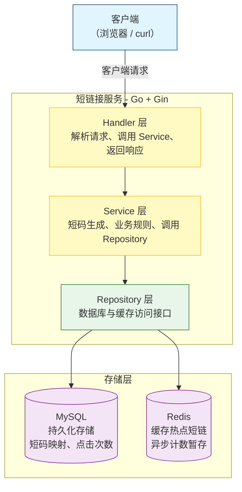
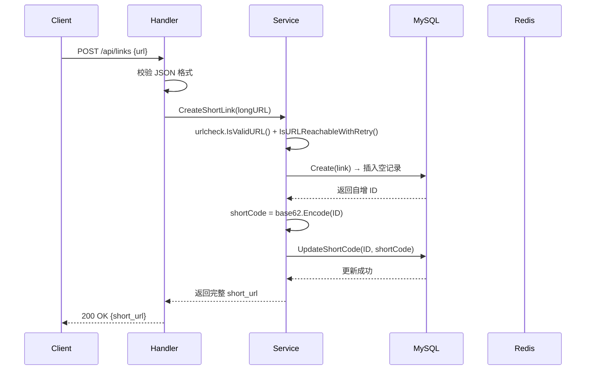
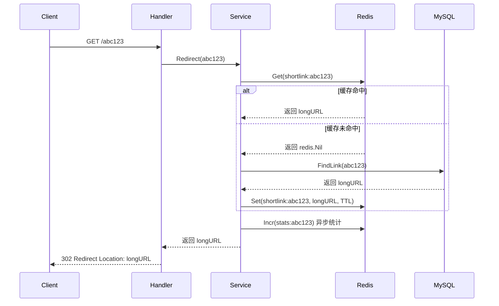
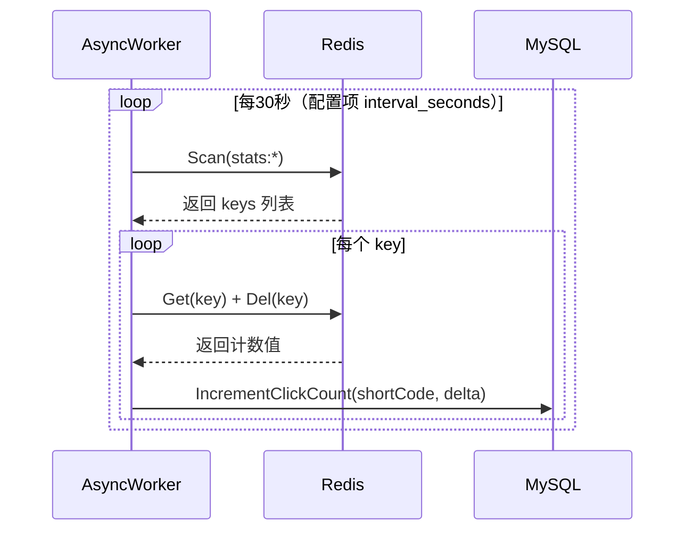

# **短链接服务 – 系统设计文档**

---

> **项目名称**：se-go-url-shortener-2026  
> 
> **版本**：v2.0  
> 
> **日期**：2026-06-17  
> 
> **编写人**：刘灿阳

---

[TOC]

---

## 一、系统架构

### 1.1 总体架构图（Mermaid）



### 1.2 核心组件说明

| 组件         | 技术选型               | 职责                                                       |
| ------------ | ---------------------- | ---------------------------------------------------------- |
| HTTP 服务    | Gin                    | 路由、请求解析、响应输出、中间件（日志、恢复、限流）       |
| 业务逻辑层   | Service 包      | 短码生成算法、重定向逻辑、点击计数、限流控制、异步统计调度 |
| 数据访问层   | Repository 接口        | 封装 MySQL 和 Redis 操作，提供统一接口                     |
| 缓存策略     | 缓存旁路模式           | 读时先查 Redis，未命中查 MySQL 并回写；写时更新 MySQL 并删除缓存 |
| 限流         | 令牌桶（golang.org/x/time/rate） | 基于 IP 的生成接口限流，防止恶意刷链                      |
| 异步统计     | goroutine + ticker     | 将点击计数先记 Redis，定时批量回写 MySQL，减少数据库写压力 |
| 配置管理     | config.toml | 加载服务端口、MySQL DSN、Redis 地址、限流参数等            |
| 日志         | log/slog               | 结构化 JSON 日志，记，支持级别控制           |

### 1.3 技术选型对比

| 决策                     | 理由                                             | 替代方案                       |
| ------------------------ | ------------------------------------------------ | ------------------------------ |
| 使用 Gin 框架            | 轻量、高性能、中间件丰富、开发效率高             | 标准库 net/http（开发较慢）    |
| 使用 GORM                | 简化数据库操作，自动防 SQL 注入，支持自动迁移    | 手写 SQL + database/sql        |
| 使用 go-redis            | 官方维护，API 友好，支持 Redis 集群              | redigo                         |
| 自增 ID 转 base62 生成短码 | 实现简单，保证唯一，无需分布式协调               | 雪花算法、随机生成+查重        |
| 缓存采用 Cache-Aside     | 经典模式，控制灵活，适合读写比例高的场景         | 先更新缓存再写数据库（易不一致）|
| 异步批量写统计           | 降低数据库写压力，提高重定向接口吞吐量           | 每次重定向直接 UPDATE MySQL    |

---

## 二、模块详细设计

### 2.1 目录结构

```
se-go-url-shortener-2026/
├── cmd/
│   └── server/
│       └── main.go                 # 程序入口，依赖组装
├── internal/
│   ├── config/                     # 配置加载与校验
│   │   └── config.go
│   ├── handler/                    # HTTP 处理层
│   │   └── handler.go
│   ├── middleware                  # 限流中间件
│   │   ├── rate_limit.go
│   │   └── rate_limit_test.go
│   ├── service/                    # 业务逻辑层
│   │   ├── service.go
│   │   └── service_test.go
│   ├── repository/                 # 数据访问层
│   │   ├── repository.go           # MySQL 操作
│   │   └── cache/  
    │       └── cache.go            # Redis 操作
│   └── model/                      # 数据模型
│       └── model.go
├── pkg/                            # 可复用工具
│   ├── base62/                     # base62 编码
│   │   ├── base62.go
│   │   └── base62.go
│   └── limiter/                    # 限流器
│   │   ├── limiter.go
│   │   └── limiter_test.go
│   ├── logger/                     # 日志初始化
│   │   ├── logger.go
│   │   └── logger_test.go
│   └── urlcheck/                   # URL 校验与可达性检查
│       ├── urlcheck.go
│       └── urlcheck_test.go
├── configs/
│   └── config.toml                 # 配置文件
├── docs/                           # 文档
├── docker-compose.yml
├── Dockerfile
├── .gitignore
├── go.mod
├── go.sum
├── README.md
└── LICENSE
```

### 2.2 配置模块 (`internal/config`)

- **功能**：从 `config.toml` 加载配置，校验参数合法性。
- **关键结构**：
  ```go
  type Config struct {
      MySQL      MySql      `toml:"mysql"`
      Redis      Redis      `toml:"redis"`
      Server     Server     `toml:"server"`
      Ratelimit  Ratelimit  `toml:"ratelimit"`
      AsyncFlush AsyncFlush `toml:"asyncflush"`
      URLCheck   URLCheck   `toml:"urlcheck"`
      Cache      Cache      `toml:"cache"`
      Log        Log        `toml:"log"`
  }
  ```

### 2.3 模型层 (`internal/model`)

```go
type LinkMap struct {
    ID         uint64    `gorm:"primaryKey;autoIncrement"`
    LongURL    string    `gorm:"column:long_url;type:text;not null"`
    ShortCode  string    `gorm:"column:short_code;type:varchar(16);uniqueIndex"`
    ClickCount int64     `gorm:"column:click_count;default:0"`
    CreateTime time.Time `gorm:"column:create_time;type:datetime;not null;default:CURRENT_TIMESTAMP"`
    UpdateTime time.Time `gorm:"column:update_time;type:datetime;not null;default:CURRENT_TIMESTAMP ON UPDATE CURRENT_TIMESTAMP"`
}
```

### 2.4 Repository 层 (`internal/repository`)

**LinkRepository** 接口：

```go
type LinkRepository interface {
    Create(lm *model.LinkMap) error
    UpdateShortCode(id uint64, shortCode string) error
    FindLink(lm *model.LinkMap, shortCode string) error
    IncrementClickCount(shortCode string, clickCount int64) error
}
```

- **MySQL** 实现：使用 GORM 操作数据库。
- **Redis** 实现（cache 包）：封装 Get/Set/Incr/Scan/Del 操作。

### 2.5 Service 层 (`internal/service`)

- **短码生成算法**：
  - 插入空记录（仅 `long_url`），获得自增 ID。
  - 调用 `base62.IntToBase62(id)` 生成短码。
  - 更新记录的 `short_code` 字段。

- **重定向逻辑**：
  - 先查 Redis 缓存（`shortlink:{shortCode}`）。
  - 命中则直接返回长链接。
  - 未命中则查 MySQL，回写 Redis，并异步增加点击计数。

- **统计计数**：每次重定向成功，执行 `Incr stats:{shortCode}`。

- **异步写入**：每 30 秒使用 SCAN 遍历所有 `stats:*` 键，累加计数值到 MySQL 的 `click_count` 字段后删除。

### 2.6 Handler 层 (`internal/handler`)

- **POST /api/links**：解析 JSON，调用 service 生成短链，返回 `short_url`。

- **GET /{code}**：获取短码，调用 service 获取长链接，返回 302 重定向。

### 2.7 限流中间件 (`internal/middleware/rate_limit + pkg/limiter`)

- 使用令牌桶算法，每个 IP 独立限流器。
- 在 POST /api/links 路由前注册。

### 2.8 异步统计模块

- 启动一个后台 goroutine，每隔 30 秒扫描 Redis 中所有 `stats:{shortCode}` 的计数器，累加到 MySQL 的 `click_count` 字段，然后删除 Redis 计数器。

---

## 三、接口设计

### 3.1 外部接口

本节仅对系统内部接口进行说明，关于服务对外暴露的HTTP API，请参阅 [接口设计说明书](3-接口设计说明书.md)。核心接口：

| 方法 | 路径            | 说明               |
| ---- | --------------- | ------------------ |
| POST | `/api/links`    | 生成短链接         |
| GET  | `/{code}`       | 重定向到原链接     |
| GET  | `/api/stats/{code}` | 获取统计信息（可选） |

### 3.2 内部接口

| 接口 | 定义 | 职责 | 调用方 |
|------|------|------|--------|
| `service.CreateShortLink` | `func (s Service) CreateShortLink(longURL string) (string, error)` | 生成短码并存储，返回完整短链接 | handler |
| `service.Redirect` | `func (s Service) Redirect(shortCode string) (string, error)` | 获取长链接（带缓存降级），并触发统计计数 | handler |
| `service.FlushStats` | `func (s Service) FlushStats()` | 批量将 Redis 统计键迁移到 MySQL | 后台 goroutine |
| `repository.Create` | `func (r Repository) Create(lm *model.LinkMap) error` | 插入记录（short_code 暂为空） | service |
| `repository.UpdateShortCode` | `func (r Repository) UpdateShortCode(id uint64, shortCode string) error` | 更新短码字段 | service |
| `repository.FindLink` | `func (r Repository) FindLink(lm *model.LinkMap, shortCode string) error` | 根据短码查询记录 | service |
| `repository.IncrementClickCount` | `func (r Repository) IncrementClickCount(shortCode string, delta int64) error` | 原子累加点击次数 | service.FlushStats |
| `cache.Set` | `func (r Redis) Set(ctx context.Context, key string, value interface{}, expiration time.Duration) error` | 设置缓存（0 时使用默认 TTL） | service |
| `cache.Get` | `func (r Redis) Get(ctx context.Context, key string) (string, error)` | 获取缓存 | service |
| `cache.Incr` | `func (r Redis) Incr(ctx context.Context, key string) (int64, error)` | 原子自增统计键 | service |
| `cache.Scan` | `func (r Redis) Scan(ctx context.Context, cursor uint64, match string, count int64) ([]string, uint64, error)` | 遍历匹配的键 | service.FlushStats |
| `cache.Del` | `func (r Redis) Del(ctx context.Context, key string) (int64, error)` | 删除键 | service.FlushStats |

---

## 四、数据流设计

### 4.1 生成短链接时序图



### 4.2 重定向时序图



### 4.3 异步统计批量回写时序图（修正间隔为 30 秒）



---

## 五、安全设计

- **限流**：生成接口基于 IP 限流，防止恶意生成大量短链。
- **SQL 注入防护**：GORM 自动使用参数化查询。
- **缓存穿透防护**：对不存在短码的请求，返回 404，不缓存空值（可扩展）。
- **输入验证**：检查 URL 协议必须为 http 或 https，且可达性经过重试（最多 3 次）。

---

## 六、性能优化

- **缓存旁路**：短链存 Redis，重定向 QPS 可提升 可达 4.4 万。
- **异步写统计**：避免每次重定向都 UPDATE 数据库。
- **连接池**：GORM 和 go-redis 默认启用连接池。
- **Gin 生产模式**：设置 `gin.SetMode(gin.ReleaseMode)` 减少日志开销。
- **移除 Gin 默认 Logger 中间件**：使用 `gin.New()` + `gin.Recovery()`。

---

## 七、扩展性与维护性

- **分层清晰**：Handler/Service/Repository 解耦，易于替换底层存储（如从 MySQL 迁移到 PostgreSQL）。
- **配置化**：所有参数通过配置文件管理。
- **单元测试**：给模块提供测试，使用 mock 隔离外部依赖。
- **Docker 部署**：一键启动全部组件。

---

## 八、部署架构

- **开发环境**：本地运行，MySQL/Redis 通过 Docker 或本地安装。

- **生产环境**：使用 Docker Compose 一键部署，包含 MySQL、Redis、短链接服务三个容器。

- **容器化**：多阶段构建，最终镜像约 20MB。

---

## 九、附录

### 9.1 术语表

| 术语       | 说明                                           |
| ---------- | ---------------------------------------------- |
| 短码       | 短链接中唯一标识部分，由 base62 字符组成       |
| 缓存旁路   | Cache-Aside，读时先查缓存，未命中再查数据库    |
| 异步统计   | 点击计数先记 Redis，定时批量写 MySQL           |
| 令牌桶     | 限流算法，以恒定速率发放令牌，请求需获取令牌   |

### 9.2 设计决策记录

| 决策                       | 理由                                       | 替代方案                   |
| -------------------------- | ------------------------------------------ | -------------------------- |
| 使用自增 ID + base62       | 简单、唯一、无需额外依赖                   | 雪花算法（需要机器 ID 协调）|
| 重定向使用 302             | 每次请求都经过服务器，保证统计准确         | 301（浏览器缓存，统计不准） |
| 异步统计而非同步更新       | 提高重定向接口吞吐量，降低数据库压力       | 同步 UPDATE（简单但性能差） |
| 不使用用户登录和多租户     | 降低复杂度，聚焦核心功能                   | 增加用户系统（未来扩展）   |

---

**版本记录**

| 版本 | 日期       | 修改说明                             |
| ---- | ---------- | ------------------------------------ |
| 1.0  | 2026-06-04 | 初始版本 |
| 2.0  | 2026-06-17 | 最终版本 |