# **短链接服务 – 测试与调优验证报告**

---

> **项目名称**：se-go-url-shortener-2026  
> 
> **版本**：v1.1  
> 
> **日期**：2026-06-17  
> 
> **编写人**：刘灿阳

---

[TOC]

---

## 一、测试概述

### 1.1 测试目标
验证短链接服务在功能、性能方面满足需求规格说明书的要求。

### 1.2 测试范围
本报告涵盖单元测试、集成测试、性能测试及性能调优全流程。其中单元测试和集成测试用于验证功能正确性，性能测试与调优则聚焦于高并发场景下的吞吐量和延迟优化。

### 1.3 测试环境

| 硬件/软件      | 配置 / 版本                                                |
| -------------- | ---------------------------------------------------------- |
| 云服务器       | 阿里云 ECS（16 vCPU 64.0 GiB）             |
| 操作系统       | Windows 11 专业版、Linux 系统 / Ubuntu 22.04                                               |
| Go 编译器      | go 1.25.4                                                  |
| 被测服务       | 短链接服务                                   |
| MySQL          | 8.0.46（本地：分离部署；云服务器：同机部署）                                         |
| Redis          | 7.2（本地：分离部署；云服务器：同机部署）                                            |
| 测试工具       | `go-wrk` (0.1)、`ab` (ApacheBench 2.3)、`wrk` (4.1.0)                      |
| 分析工具       | `pprof`、火焰图                                            |

### 1.4 性能测试方法
- **短时峰值测试**：使用 `ab` 模拟高并发短时间请求，测量极限 QPS 和延迟，并与同并发数下 `wrk` 进行对比。
- **长时间稳定性测试**：使用 `wrk` 持续压测 5 分钟，观察性能衰减和错误率。
- **性能分析**：通过 `pprof` 采集 CPU 和 goroutine profile，生成火焰图定位瓶颈和观察 goroutine 数量。

---

## 二、单元测试结果

### 2.1 单元测试用例执行情况

| 模块   | 测试内容                                                                                       | 验证点                     | 覆盖率目标 | 实际覆盖率 |
| ------- | ------------------------------------------------------------------------ | ------------------------------ | ---------- | ---------- |
| base62  | 正常数字转换、边界值（0, 1, 61, 62）                           | 编码唯一且符合字符集           | 100%       |  100% |
| urlcheck| URL 格式校验（合法/非法）；可达性检查（模拟服务器：200/404/405/超时等）  | 返回正确错误类型，重试逻辑正确 | ≥ 90%      |   100%  |
| limiter | 单 IP 限流、多 IP 独立、令牌恢复、并发安全（-race）                      | Allow 返回值正确               | 100%       |   100%   |
| service | CreateShortLink（正常/数据库错误）、Redirect（缓存命中/未命中/降级）、FlushStats（批量写入成功/失败） | 业务逻辑正确，错误处理得当     | ≥ 85%      |   90%   |
| logger  | 日志级别解析、文件创建、默认输出                                         | 初始化无 panic，文件可写       | ≥ 80%      |    90%   |
| rate_limit | 常不限流、触发限流返回 429	                     | 状态码和响应体正确               | ≥ 80%       |   100%   |

> **运行截图**：详见附录 A。

---

## 三、集成测试结果

### 3.1 集成测试用例执行情况

| 编号 | 测试项         | 操作步骤                                         | 预期结果                                                   | 实际结果               |
| ---- | -------------- | ------------------------------------------------ | ---------------------------------------------------------- | ---------------------- |
| IT01 | 生成短链（正常）   | `curl -X POST http://localhost:8080/api/links -H "Content-Type: application/json" -d '{"url":"https://example.com"}'`                                                   | 返回 JSON 包含 `short_url`，状态码 200                        | 正确返回短链接 |
| IT02 | 生成短链（格式错误）| `curl -X POST http://localhost:8080/api/links -H "Content-Type: application/json" -d '{"url":"example.com"}'`                                                            | 返回 `{"error":"invalid url format"}`，状态码 400             |  返回错误信息  |
| IT03 | 生成短链（不可达） | `curl -X POST http://localhost:8080/api/links -H "Content-Type: application/json" -d '{"url":"http://.com"}'`                                                            | 返回 `{"error":"url not reachable after retry"}`，状态码 400  |  返回错误信息，写入日志  |
| IT04 | 重定向成功         | 先通过 IT01 获得短码（如 `abc123`），然后 `curl -v http://localhost:8080/abc123`                                                                                         | 响应头 `Location` 指向长链接，状态码 302                      |   返回重定向内容和 302 |
| IT05 | 重定向（短码不存在）| `curl -v http://localhost:8080/notexist`                                                                                                                                | 返回 404 及 `{"error":"短链不存在"}`                          |   返回错误信息 |
| IT06 | 限流验证           | 连续快速发送 6 次 POST 请求（限流配置：每12秒5个令牌），观察响应                                                                                                         | 前5次成功，第6次返回 429 `{"error":"too many requests"}`     |   返回错误信息  |
| IT07 | 缓存验证           | 首次访问短链后，检查 Redis 中是否存在 `shortlink:短码` 键（例如 `docker exec -it redis-dev redis-cli GET shortlink:abc123`）                                            | 键存在且值为长链接                                            |    显示原始长链接信息 |
| IT08 | 统计计数（异步）   | 多次访问同一短链，等待 30 秒（默认异步间隔 5 秒，增加以便观察），观察 MySQL 中 `click_count` 字段是否累加，Redis 中 `stats:短码` 键是否被删除                                                | 数据库计数增加，Redis 统计键消失                              |  数据库计数字段正确增加， Redis 对应键已删除 |

> **运行截图**：详见附录 B。

---

## 四、初始性能测试

### 4.1 环境配置
- Windows 11 专业版（本机）、Linux 虚拟机（VMware，2 核 4 G）
- MySQL 和 Redis 部署在本地（分离部署）

### 4.2 测试结果

| 工具 | 并发 | 总请求 | QPS   | P99 延迟(ms) | 错误率 |
|------|------|-------------|-------|----------|--------|
| go-wrk   | 100  | 50000        | 2659.65  | 54     | 0%     |

**观察**：QPS 明显偏低（不足 3000），与需求目标（≥ 5000）差距较大。分析可能原因：
- 虚拟机本身存在资源争抢（CPU 抢占、内存交换）。
- 虚拟机网络栈与宿主机之间存在额外开销和网络延迟。
- 未对服务做任何性能优化。

**决策**：为排除本地环境干扰，获取更真实的性能数据，将服务迁移至阿里云 ECS 实例进行后续测试。

## 五、初始性能测试（云服务器部署）

### 5.1 环境配置
- 云服务器配置（16 核 64 G，通用算力型 u1）
- 服务、MySQL 和 Redis 同机部署

### 5.2 `ab` 短时峰值测试结果

| 并发 | 总请求数 | 平均 QPS | 平均延迟 (ms) | P95 延迟 (ms) | 错误率 |
|------|------|-------------|-------|----------|--------|
| 10  | 1000        | 25021.33  | 0.401     | 1  |0%     |
| 100  | 50000         | 44247.35  | 2.26    | 5  |0%     |
| 200  | 100000         | 43881.49  | 4.558    | 11  |0%     |
| 500  | 250000         | 41328.33  | 12.126    | 31  |0%     |

**分析**：`ab` 测试表现良好，QPS 接近 4.4 万，延迟极低，说明服务在短时突发压力下性能优异。

### 5.3 `wrk` 长时间稳定性测试（初次）

| 并发  | 时长 (s) | QPS     | 平均延迟 (ms) | P99 延迟 (ms) | 错误率 |
| ---- | ------------ | ------- | ------------- | ------------- | ------ |
| 100   |30        | 39781.12 | 3.03         | 16.21         | 0%     |
| 200  | 30      | 0       | -            | -           | 超时    |
| 500  | 30      | 0       | -            | -           | 超时    |
| 200  | 300     | 0       | -            | -           | 超时    |

**问题现象**：`wrk` 在并发 200 及以上时服务完全无响应（连接超时），控制台出现大量 `Socket errors: timeout`。

### 5.4 `wrk` 问题复测与初步分析

重启服务后重新测试，部分情况下能获得不稳定数据：

| 并发  | 时长 (s) | QPS     | 延迟 (ms) | P99 延迟 (ms) | 错误率 |
| ---- | ------------ | ------- | ------------- | ------------- | ------ |
| 200  | 30       | 7899.49 | 38.18         | 127.77         | 0%     |
| 200  | 60        | 4862.04 | 49.97         | 144.61         | 0%     |
| 500  | 60        | 4734.70 | 120.53         | 476.93         | 0%     |
| 200  | 300        | 4642.82 | 157.80         | 52.07         | 0%     |

**观察**：
- `wrk` 测试结果极不稳定，有时直接超时，有时 QPS 大幅低于 `ab`（仅 4000~8000）。
- 超时现象与服务端日志大量输出有关，高并发下日志 I/O 可能导致服务短暂阻塞，进而触发客户端超时。

**初步怀疑**：日志系统（Gin 访问日志 + 应用日志）在高并发持续压力下成为瓶颈，导致服务间歇性不可用。需要进一步通过 pprof 定位。

---

## 六、性能分析与定位

### 6.1 使用 pprof 采集 CPU 和 goroutine profile
在服务启动时开启 pprof：
```go
go func() {
    http.ListenAndServe("0.0.0.0:6060", nil)
}()
```
压测期间采集数据：
```bash
curl -o cpu_$(date +%Y%m%d_%H%M%S).prof http://localhost:6060/debug/pprof/profile?seconds=30
curl -s http://localhost:6060/debug/pprof/goroutine?debug=2 | grep -c "^goroutine"
```

### 6.2 火焰图与关键发现
- **CPU profile**：主要耗时集中在 `runtime.systemstack`、`syscall.Syscall` 和 `log.(*Logger).Output`，说明日志写入占用了大量 CPU。
- **Goroutine profile**：压测期间 goroutine 数量随并发上升（200并发时约 400，500并发时约 1000），无异常积压，说明并发模型健康。

### 6.3 结论
- **Gin 默认的 Logger 中间件** 每个请求都会输出一次访问日志，高并发下产生海量系统调用。
- **同步日志** 写入文件也增加了磁盘 I/O 开销。
- 数据库连接池默认值较小，但对当前瓶颈贡献不大，可后续优化。

---

## 七、性能调优措施

| 调优项                     | 具体操作                                                                 |
| -------------------------- | ------------------------------------------------------------------------ |
| 移除 Gin 默认日志中间件    | 将 `gin.Default()` 改为 `gin.New()`，仅保留 `gin.Recovery()`。          |
| 减少应用日志输出           | 配置文件 `log.level = "error"`，`log.file_path = ""` 禁用文件输出。（在实际生产环境中，建议根据运维需求保留文件输出，并采用异步日志库）       |
| 开启 Gin Release 模式      | `gin.SetMode(gin.ReleaseMode)`。                                         |
| 调整数据库连接池           | `sqlDB.SetMaxOpenConns(100)`，`sqlDB.SetMaxIdleConns(10)`。              |

---

## 八、最终性能测试（调优后）

### 8.1 测试环境
- 云服务器配置（16 核 64 G，通用算力型 u1）
- 应用上述所有调优措施

### 8.2 测试结果

| 工具 | 并发 | 总请求/时长 (s) | QPS    | P99 延迟 (ms) | 错误率 |
|------|------|-------------|--------|----------|--------|
| ab   | 200  | 10000       | 44168.73   | 11     | 0%     |
| wrk  | 200  | 60        | 44035.11 | 12.22   | 0%     |
| wrk  | 500  | 60        | 43717.38 | 18.95   | 0%     |
| wrk  | 200  | 300        | 43821.35 | 12.02   | 0%     |

**说明**：`ab` 与 `wrk` 结果基本一致，长时间稳定性测试无性能衰减，goroutine 数量稳定在 400~1000 之间。

### 8.3 不同实例规格对比

| 实例规格        | CPU 核心 (核) | 内存 (GiB) | 并发200 QPS | P99延迟 (ms) |
|----------------|--------|------|-------------|---------|
| 通用算力型 u1  | 4    | 4 | ~21000      | 15    |
| 通用算力型 u1  | 16   | 64| ~44000      | 12    |

### 8.4 结论
- 通过移除 Gin 默认日志中间件和优化应用日志，**QPS 从初始的 4400（wrk）提升至 44000**，提升超过 10 倍。
- 调优后的服务在 16核64G 实例上达到 **QPS 4.4 万，P99 延迟 < 20ms**，远超需求指标（QPS ≥ 5000）。
- 在低配实例（4 核 4 G）上，调优后 QPS 仍可达 21000，满足一般生产需求。

### 8.5 建议
- **生产环境部署**：建议使用 4 核 8 G 及以上规格，关闭 Gin 访问日志，应用日志级别设为 `error`。
- **持续监控**：可接入 Prometheus 暴露 `/metrics`，实时观察 QPS 和延迟。
- **容器化部署**：使用 Docker 打包，便于快速扩缩容。

## 九、安全性测试结果

### 9.1 安全性测试用例执行情况
| 编号 | 测试项 | 操作步骤 | 预期结果 | 实际结果 | 状态 |
|------|--------|----------|----------|----------|------|
| ST01 | 限流防刷             | 同 IT06，快速发送超过阈值的请求                                           | 返回 429                    |返回 `{"error":"too many requests"}` 和 429                     | **通过** |
| ST02 | SQL 注入             | 生成短链时 `url` 字段尝试 `' OR 1=1 --`                                   | 不会导致 SQL 错误，应返回格式错误或不可达     | 返回 `{"error":"url not reachable after retry"}`，状态码 400	   | **通过** |
| ST03 | 恶意长链（JavaScript） | `curl -X POST ... -d '{"url":"javascript:alert(1)"}'` | 返回 400 错误 | 返回 `{"error":"invalid url format"}`，状态码 400 | **通过** |
| ST04 | 超长 URL | 生成 3000+ 字符的 URL 并请求 | 服务正常处理，返回短链或明确错误 | 返回 `{"error":"url not reachable after retry"}`，服务未崩溃 | **通过** |

> **运行截图**：详见附录 C。

---

## 附录 A：单元测试运行截图

base62 包：
> 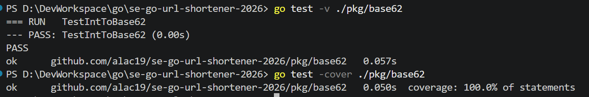

urlcheck 包：
> 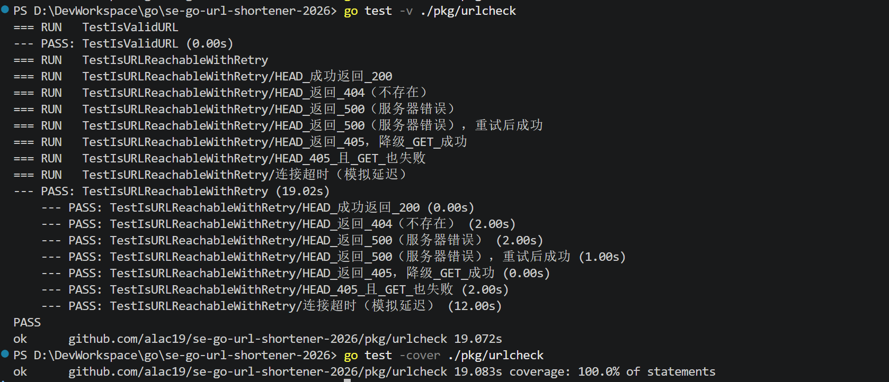

limiter 包：
> 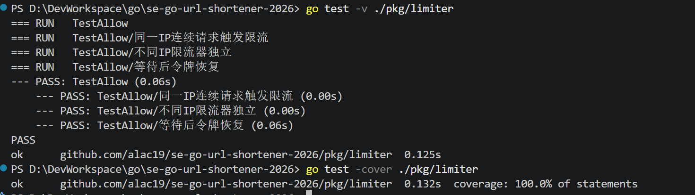

service 层：
> 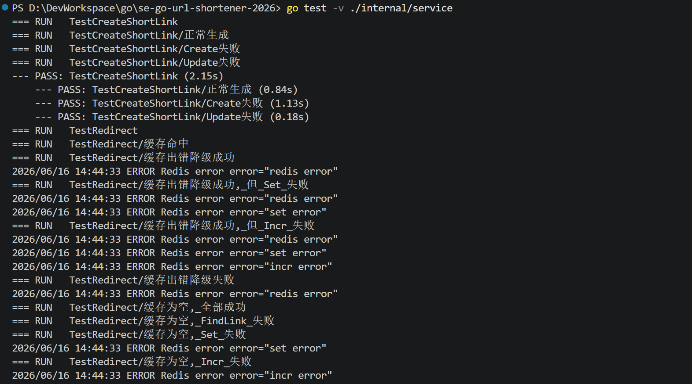
> 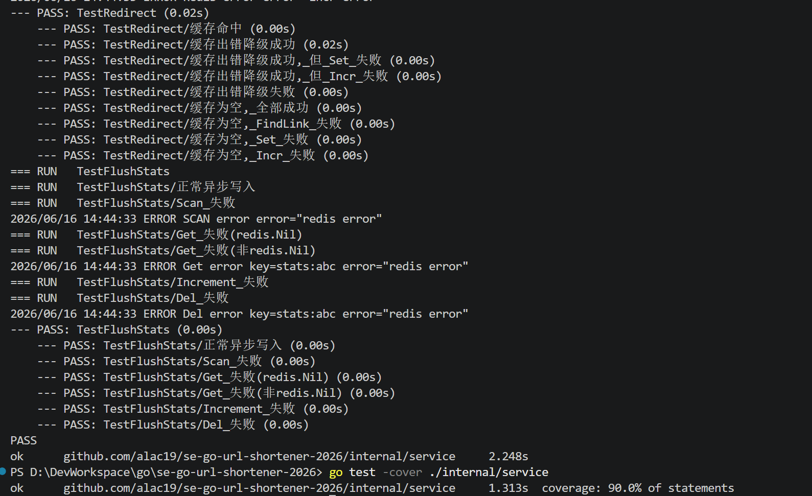
> 
logger 包：
> 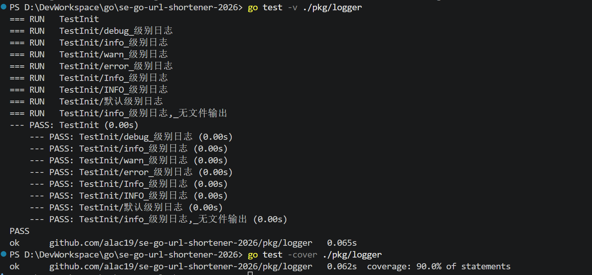

rate_limit 中间件：
> 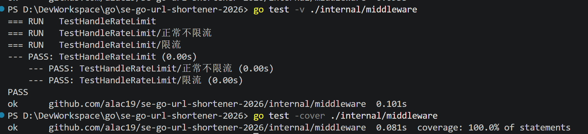

## 附录 B：集成测试运行截图

IT01：
> 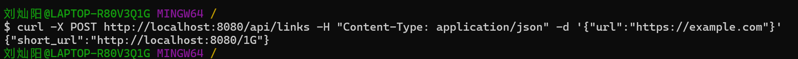

IT02：
> 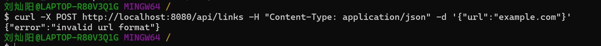

IT03：
> 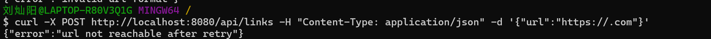
> 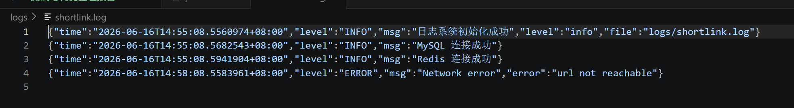

IT04：
> 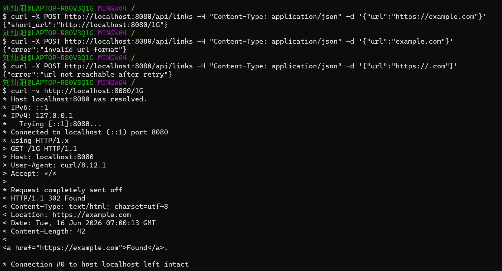

IT05：
> 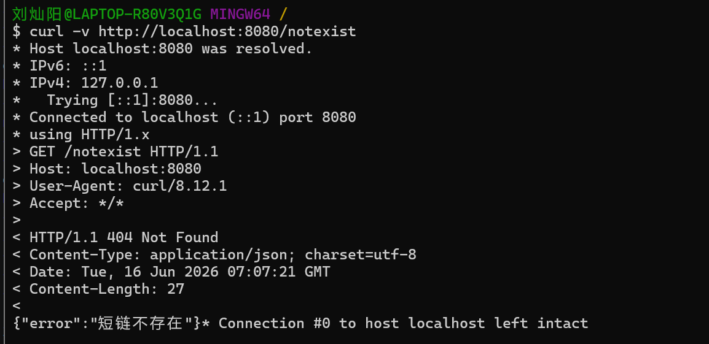

IT06：
> 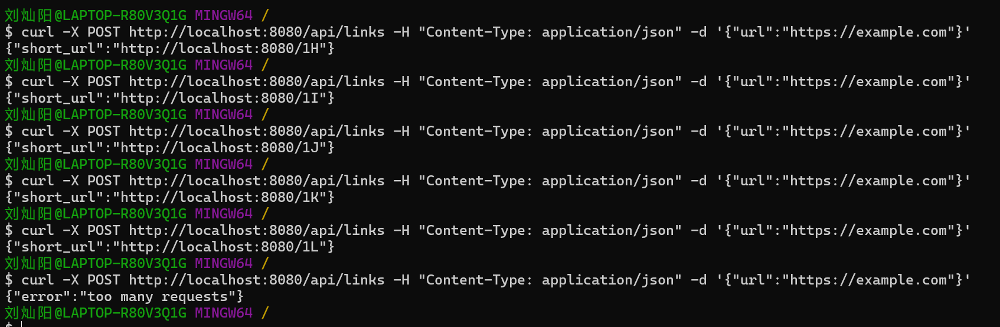

IT07：
> 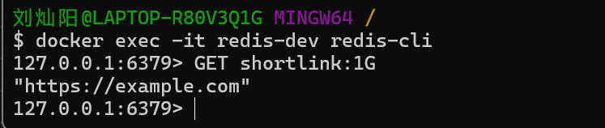

IT08：
> 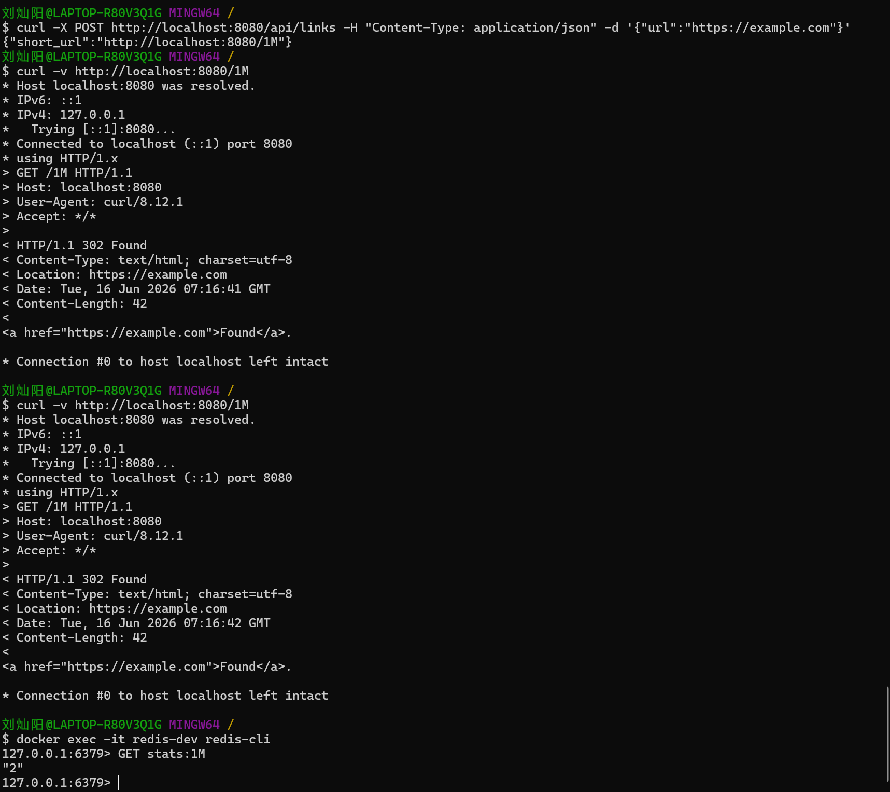
> 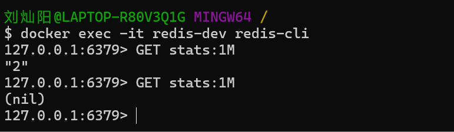
> 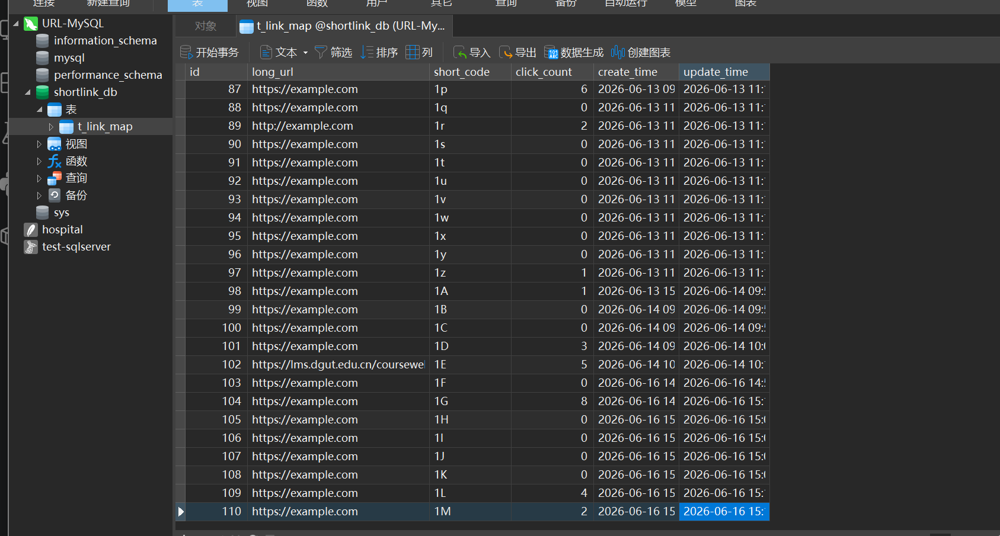

## 附录 C：安全性测试运行截图

ST01：
> 

ST02：
> 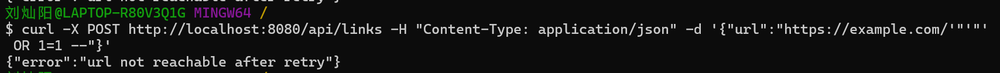

ST03：
> 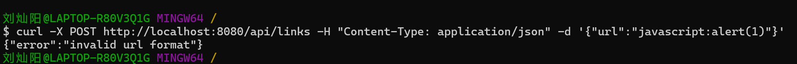

ST04：
> 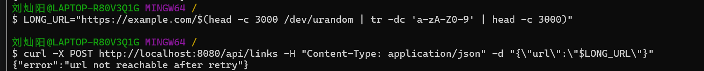

---

**版本记录**

| 版本 | 日期       | 修改说明                             |
| ---- | ---------- | ------------------------------------ |
| 1.0  | 2026-06-15 | 初始版本                             |
| 1.1  | 2026-06-17 | 最终版本                             |